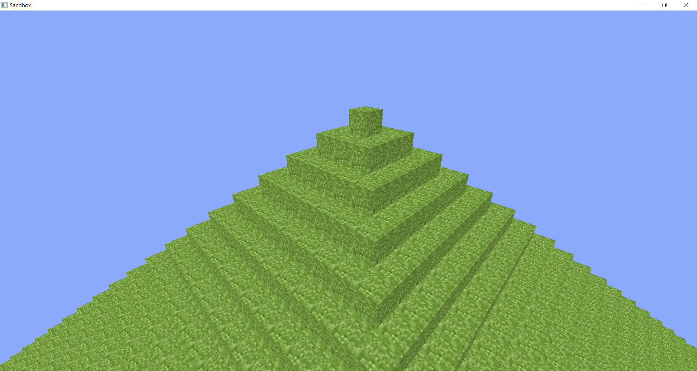

# Sandbox: another Minecraft clone

The app is currently in kind of pre-alpha stage.
Sandbox is a temporary title (maybe).

## This game will focus on building

Now there is nothing to place or break blocks in the game. Although you already can move with keyboard and mouse.



### What will be added into the game?

Someday you'll see here possibilities to:
* create and save worlds
* edit worlds
* customize the game with mods and other tools
* play online with friends
* install amazing shaders

## Installation

The program is built via CMake. Now only MSVC support has been implemented. In future, I am going to add GCC support and other Windows&Linux compilers.

You should download SDL2 by yourself and set the path to it in `cmake/path_to_sdl2.cmake`.

```cmake
set(SDL2_PATH YOUR_PATH_TO_SDL2_FILES)
```
